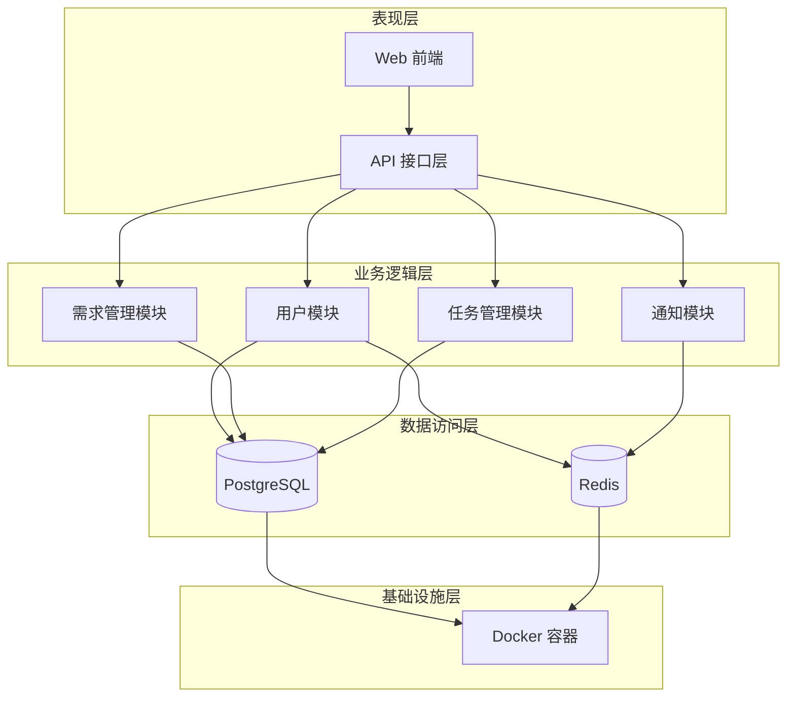
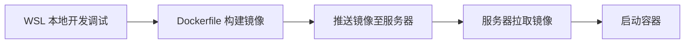
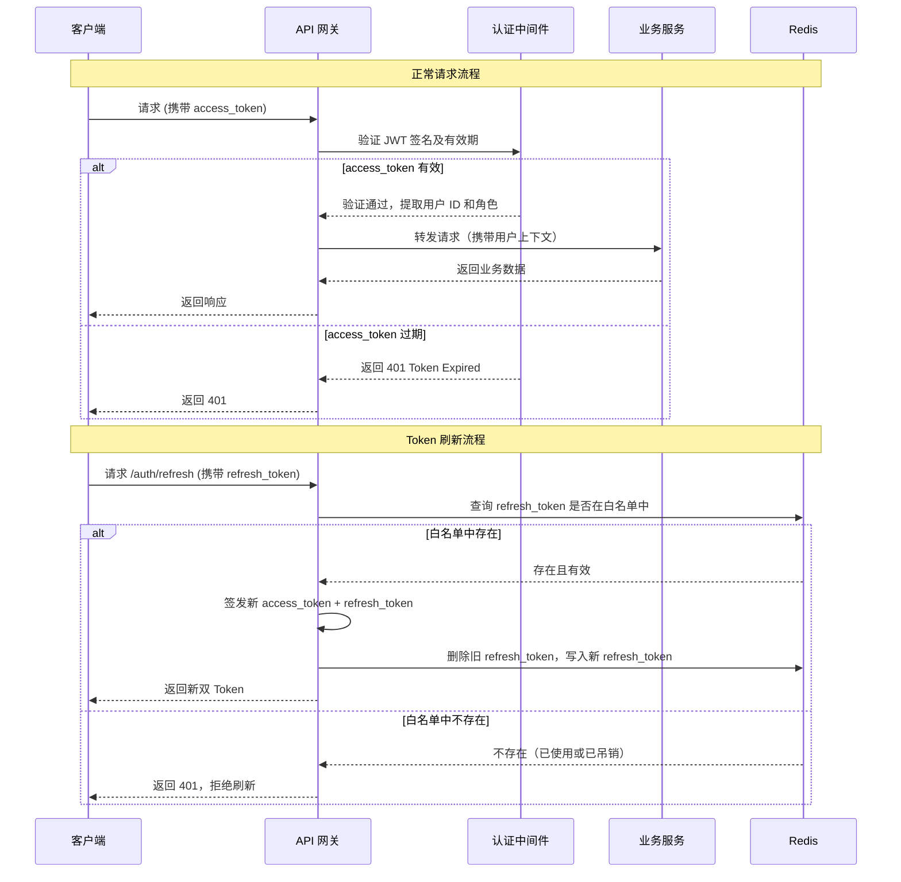

# 罕见病运营管理平台 技术架构文档

---

## 1. 文档信息

| 项目     | 内容                   |
| -------- | ---------------------- |
| 项目名称 | 罕见病运营管理平台     |
| 文档版本 | v0.4                   |
| 作者     | 蒋政宇                 |
| 创建日期 | 2026-06-04             |
| 最后更新 | 2026-06-09             |
| 文档状态 | 草稿                   |

---

## 2. 修订记录

| 版本 | 日期       | 修改人 | 修改内容                                         |
| ---- | ---------- | ------ | ------------------------------------------------ |
| v0.1 | 2026-06-04 | 蒋政宇 | 初始版本，基于第一阶段技术沟通（技术架构与选型）整理 |
| v0.2 | 2026-06-06 | 蒋政宇 | 补充前端技术栈（Vue 3 全家桶）、确认 ORM 为 SQLAlchemy 2.0.50、数据库由 MySQL 改为 PostgreSQL 18、补全所有组件版本号、确认 JWT 双 Token 认证方案、补充认证流程图、补充开发工具链说明 |
| v0.3 | 2026-06-06 | 蒋政宇 | 确认权限粒度（API 级 RBAC）、日志方案（loguru）、部署方案（Docker Compose 分开部署）、备份策略（每日全量）；全文审查修正过期提示、补全遗漏项、修正认证流程图逻辑 |
| v0.4 | 2026-06-09 | 蒋政宇 | 补充表现层部署方案（Nginx 静态托管 + CORS）、缓存策略（Cache-Aside）、数据库迁移方案（Alembic）、API 版本控制规范；补全 loguru 版本号和 Axios 选型理由；清理待确认事项（标记已确认项）；整理备份策略备注 |

---

## 3. 系统概述

### 3.1 项目背景

罕见病领域长期面临社会关注不足、医疗资源匮乏的问题。当前患者缺少有效的工具来管理用药、追踪症状，同时也缺少渠道将自身需求传递给有技术能力的社会公益人员。本项目旨在构建一个线上协作平台，让罕见病患者（及其家属）提出工具开发需求，由社区志愿者（开发者、设计师等）组队认领并完成开发，实现罕见病问题的社会化协作解决。

### 3.2 系统目标

- **业务目标**：实现需求提交 → 审核 → 任务发布 → 组队开发 → 验收交付的全流程线上化，降低运营人力成本
- **性能目标**：页面加载时间 < 3 秒，接口响应时间 < 2 秒，支持 1000 人并发访问
- **可用性目标**：[待补充]
- **安全目标**：密码 bcrypt 加密存储、全链路 HTTPS 传输、前后端双重鉴权

### 3.3 系统范围

**系统包含范围：**

- 用户注册登录系统：注册、登录、忘记密码
- 需求提交与管理：患者/家属提交需求，产品经理审核、沟通、转化
- 任务管理与认领：任务大厅、组队开发、进度跟踪
- 工作台（运营功能）：需求管理、任务管理、用户管理、权限管理
- 个人中心：我的需求、我的任务
- 消息通知：站内通知、短信通知

**系统不包含范围（二期规划）：**

- 社区交流功能
- 积分制度
- 医护认证流程
- AI 需求优化功能
- 移动端适配

---

## 4. 技术选型

### 4.1 后端技术栈

| 组件     | 技术选型 | 版本   | 选型理由                                                                                     |
| -------- | -------- | ------ | -------------------------------------------------------------------------------------------- |
| 开发语言 | Python   | 3.12 | 团队技术储备匹配，生态丰富，开发效率高                                                       |
| Web 框架 | FastAPI  | 0.136.3 | 基于 Python 的现代异步框架，内置 OpenAPI 接口文档自动生成，适用于构建高性能 RESTful API 服务   |
| ORM 框架 | SQLAlchemy | 2.0.50 | Python 生态中最成熟的 ORM 库，用 Python 类定义数据表结构，通过对象方法完成增删改查，基本无需手写 SQL；支持自动生成数据库表，且可充分利用 PostgreSQL 的高级特性（JSONB、全文搜索等） |
| API 文档 | FastAPI 内置 OpenAPI与 | - | FastAPI 自动生成 Swagger UI 和 ReDoc 接口文档，无需额外工具                               |
| 日志框架 | loguru | 0.7.3 | 轻量级日志库，API 简洁，开箱即用；当前项目规模较小，loguru 足以满足需求，后续如日志量增大可迁移至 ELK 等集中式方案 |

### 4.2 前端技术栈

> 前端已有 Demo，正式开发时从中抽取组件。组件库采用自建方案：底层使用无头组件库（Headless UI Library）提供交互逻辑，上层封装自定义样式，确保长期使用 AI 开发时的 UI 一致性，后续构建门户网站时可直接复用组件。

| 组件        | 技术选型   | 版本     | 选型理由   |
| ----------- | ---------- | -------- | ---------- |
| 框架        | Vue 3      | @latest | 组合式 API（Composition API）更适合复杂业务逻辑组织，生态成熟，社区活跃 |
| 类型系统    | TypeScript | @latest | 静态类型检查，减少运行时错误，配合 AI 开发时能提供更准确的代码补全和错误提示 |
| 构建工具    | Vite       | @latest | 基于 ESM 的极速开发服务器，热更新速度快，Vue 3 官方推荐构建工具 |
| 状态管理    | Pinia      | @latest | Vue 3 官方推荐的状态管理方案，轻量且类型友好，替代 Vuex |
| 路由        | Vue Router | @latest | Vue 官方路由方案，支持路由守卫、懒加载等，满足平台多角色页面的权限控制需求 |
| 组件库      | 自建（基于RekaUI无头组件库） | - | 底层用无头组件库提供交互逻辑，上层封装统一样式；保证 AI 辅助开发时的组件一致性，且可复用于后续门户网站 |
| HTTP 客户端 | Axios | @latest | 支持请求/响应拦截器，可统一处理 Token 自动携带、access_token 过期刷新和全局错误提示；社区成熟，与 Vue 3 项目集成良好 |

### 4.3 数据库

| 组件       | 技术选型 | 版本     | 选型理由                                                       |
| ---------- | -------- | -------- | -------------------------------------------------------------- |
| 关系型数据库 | PostgreSQL | 18 | 功能强大的开源对象关系型数据库，支持丰富的数据类型和高级查询优化；原生支持 JSON/JSONB、全文搜索、窗口函数等特性，适合复杂业务场景的事务处理和关联查询 |
| 文档数据库 | 无       | -        | 当前业务场景无需使用文档型数据库                                 |

### 4.4 缓存

| 组件       | 技术选型 | 版本     | 选型理由                                                                                               |
| ---------- | -------- | -------- | ------------------------------------------------------------------------------------------------------ |
| 分布式缓存 | Redis    | 7.4 | 高性能内存键值存储，本项目中覆盖三个场景：短信验证码存储与过期管理、用户登录态管理、系统内部消息队列     |
| 本地缓存   | 无       | -        | 当前阶段业务规模较小，无需引入本地缓存，Redis 分布式缓存已满足需求                          |

### 4.5 消息队列

| 组件     | 技术选型                  | 版本 | 选型理由                                                                                                     |
| -------- | ------------------------- | ---- | ------------------------------------------------------------------------------------------------------------ |
| 消息队列 | Redis Stream（复用缓存实例） | - | 当前阶段消息量有限，复用 Redis Stream 作为轻量级消息队列（如短信验证码发送、入队审批超时提醒等），Stream 支持消息持久化和消费确认，可靠性优于 Pub/Sub；无需引入独立消息队列组件 |

### 4.6 文件存储

| 组件     | 技术选型         | 版本 | 选型理由                                                                                                   |
| -------- | ---------------- | ---- | ---------------------------------------------------------------------------------------------------------- |
| 文件存储 | 服务器本地磁盘   | -    | 当前阶段文件量有限（需求附件和用户头像），暂存服务器本地。后续视文件增长情况可迁移至对象存储服务（如阿里云 OSS） |

---

## 5. 系统架构

### 5.1 整体架构描述

系统采用前后端分离的分层架构。前端负责页面展示和用户交互，后端负责业务逻辑和数据处理，两端通过 RESTful API 进行数据交互。

> 以上为初步架构示意，具体模块划分和组件交互方式待后端完成 API 设计后进一步细化。

### 5.2 表现层

- **前端应用**：Vue 3 单页应用（SPA），构建后输出静态文件，由 Nginx 托管；Nginx 同时作为反向代理，将 `/api/` 前缀的请求转发至后端 FastAPI 服务
- **API 路径规范**：所有后端接口统一使用 `/api/v1/` 前缀（如 `/api/v1/users/register`），为后续接口版本升级预留空间
- **跨域策略（CORS）**：前端开发环境通过 Vite 代理配置解决跨域；生产环境由 Nginx 统一配置 CORS 响应头，仅允许前端域名访问
- **负载均衡**：[待补充 — 当前阶段单实例部署，后续视流量增长引入]

### 5.3 业务逻辑层

- **架构模式**：单体应用（Monolithic Application），当前阶段业务规模较小，采用单体架构降低开发和运维复杂度
- **服务间通信**：单体架构内各模块通过 Python 函数直接调用，无需网络通信；后续如需拆分微服务，可引入消息队列或 RPC 框架
- **核心业务模块**：
  - 用户模块：注册、登录、忘记密码、个人信息管理
  - 需求管理模块：需求提交、审核、沟通、转化
  - 任务管理模块：任务发布、认领、组队、进度跟踪
  - 通知模块：站内通知、短信通知
  - 权限管理模块：角色管理、权限控制

> 模块间的详细交互方式和内部设计待后端完成 API 设计后补充。

### 5.4 数据访问层

- **ORM 方案**：SQLAlchemy，使用 Python 类定义数据模型，通过对象方法完成数据库操作，基本无需手写 SQL；正式开发时要求 AI Agent 工具（如 Codex）统一按 SQLAlchemy 语法生成模型和查询代码
- **数据库迁移**：Alembic（SQLAlchemy 官方迁移工具），每次数据表结构变更生成迁移脚本，纳入版本控制；团队成员拉取代码后执行迁移命令即可同步表结构，避免手动建表的版本不一致问题
- **数据库连接池**：SQLAlchemy 内置连接池（QueuePool），默认配置可满足当前阶段需求
- **缓存策略**：采用 Cache-Aside（旁路缓存）模式 — 读取时先查 Redis，命中则直接返回，未命中则查数据库并写入缓存；写入时先更新数据库再删除缓存。短信验证码等仅存 Redis 的数据不走数据库
- **读写分离**：当前阶段无读写分离需求，后续视数据量增长决定

### 5.5 基础设施层

- **容器化**：Docker，在本地 WSL 环境中完成开发配置，构建镜像后推送至服务器部署
- **编排调度**：Docker Compose，统一管理应用服务、PostgreSQL、Redis 三个容器的启停和网络互联
- **监控**：[待补充]
- **日志**：loguru，日志输出至文件，按日期和大小自动轮转
- **告警**：[待补充]
- **开发工具链**：正式开发使用 AI Agent 工具（如 Codex 等）辅助编码，要求 Agent 统一按 SQLAlchemy 语法生成数据模型和查询代码，确保代码风格一致

---

## 6. 部署架构

### 6.1 服务器配置

| 用途         | 规格      | 数量     | 操作系统    | 地域/可用区 |
| ------------ | --------- | -------- | ----------- | ----------- |
| 应用服务器   | 待运维团队确认 | 待运维团队确认 | 待运维团队确认 | 待运维团队确认 |
| 数据库服务器 | 待运维团队确认 | 待运维团队确认 | 待运维团队确认 | 待运维团队确认 |
| 缓存服务器   | 待运维团队确认 | 待运维团队确认 | 待运维团队确认 | 待运维团队确认 |

> 注：服务器配置由运维团队负责。PostgreSQL 和 Redis 分开部署（各自独立容器），通过 Docker Compose 统一管理。

### 6.2 部署流程

部署采用 Docker 容器化方案，开发流程如下：

1. **本地开发**：在 WSL（Windows Subsystem for Linux）环境中进行项目配置和调试
2. **镜像构建**：确认本地运行无误后，使用 Dockerfile 构建 Docker 镜像
3. **镜像推送**：将构建好的镜像推送至服务器
4. **服务器部署**：在服务器上拉取镜像并启动容器

> 分支策略、代码审查流程、自动化测试等细节待后续补充。

### 6.3 CI/CD 方案

- **CI/CD 工具**：[待补充]
- **构建环境**：本地 WSL + Docker
- **制品管理**：[待补充 — 镜像仓库选型待确认]
- **环境管理**：[待补充 — 开发/测试/生产环境的配置差异待确认]

---

## 7. 安全架构

### 7.1 认证方案

- **认证方式**：JWT（JSON Web Token），无状态方案，便于水平扩展
- **选型理由**：无状态设计，服务端无需维护会话信息，天然支持多实例横向扩展；相比 Session 方案更适合容器化部署场景
- **Token 管理**：
  - **access_token**：有效期 15 分钟，用于 API 请求鉴权
  - **refresh_token**：有效期 7 天，仅用于换取新的 access_token
  - **刷新机制**：前端在 access_token 过期时，使用 refresh_token 请求 `/auth/refresh` 接口；后端校验 refresh_token 是否存在于 Redis 白名单中，校验通过后签发新的 access_token + refresh_token（双 token 轮换），旧的 refresh_token 立即失效（一次性使用，防重放攻击）
  - **安全策略**：refresh_token 存储于 Redis 白名单，支持主动吊销（如用户登出、异地登录踢出等场景）

### 7.2 授权模型

- **授权模型**：RBAC（基于角色的访问控制），PRD 中定义了四种系统角色：需求者（患者/家属）、共建者（志愿者）、产品经理、超级管理员
- **权限粒度**：API 级别 — 每个后端接口均进行权限校验
- **鉴权流程**：
  1. 每个 API 请求通过 JWT 解析出用户 ID 和角色信息
  2. 权限中间件（FastAPI Depends）校验该用户是否拥有对应"资源 + 操作"的权限（如 `demand:create`、`task:approve`）
  3. 校验通过则放行，否则返回 403 Forbidden
- **角色设计**：

| 角色           | 权限范围                                                       |
| -------------- | -------------------------------------------------------------- |
| 超级管理员     | 全部功能，包括用户管理和权限管理                               |
| 产品经理       | 需求管理（审核/转化/驳回）、任务管理（编辑/干预）               |
| 共建者（志愿者）| 查看任务大厅、加入队伍、提交需求、查看个人中心和我的任务         |
| 需求者（患者/家属）| 提交需求、查看需求进度、查看任务大厅、查看个人中心            |

> 完整权限矩阵待确认后补充。

### 7.3 数据安全

- **密码存储**：bcrypt 加密（PRD 要求）
- **敏感字段加密**：[待补充 — 手机号等敏感字段的加密方案]
- **数据脱敏**：[待补充]
- **备份策略**：前期访问量较小，采用每日全量备份方案；备份文件通过 OSS（对象存储服务）存储，保留最近 30 天，定期自动清理过期备份（后续流量增长后可调整为全量 + 增量备份组合策略）

### 7.4 传输安全

- **HTTPS**：[待补充 — 证书类型和颁发机构]
- **TLS 版本**：[待补充]
- **API 安全**：JWT 鉴权（详见 7.1 认证方案），所有接口均需携带有效 access_token
- **网络安全**：[待补充]

---

## 8. 第三方服务

| 服务名称       | 用途               | 供应商   | 接入方式   | 状态   |
| -------------- | ------------------ | -------- | ---------- | ------ |
| 阿里云云短信   | 注册/重置验证码、入队审批超时通知 | 阿里云 | REST API | 待接入 |

---

## 9. 非功能需求实现

### 9.1 性能方案

**性能目标（PRD 要求）：**

- 页面加载时间：< 3 秒
- 接口响应时间：< 2 秒
- 并发用户数：支持 1000 人
- 数据库复杂查询：< 1 秒

**实现手段：**

- **缓存**：使用 Redis 缓存热点数据，减少数据库查询压力
- **异步处理**：[待补充]
- **数据库优化**：[待补充]
- **CDN 加速**：[待补充]

### 9.2 可用性方案

- **可用性目标**：[待补充]
- **保障措施**：[待补充]

### 9.3 可扩展性方案

- **水平扩展**：[待补充]
- **数据库扩展**：[待补充]
- **功能扩展**：[待补充]

---

## 10. 待确认事项

| 序号 | 事项                                           | 所属章节 | 优先级 | 当前状态 | 负责确认人 |
| ---- | ---------------------------------------------- | -------- | ------ | -------- | ---------- |
| 1    | ~~PostgreSQL 具体版本号~~（已确认：18）          | 4.3      | ~~高~~ | **已确认** | ~~后端开发者~~ |
| 2    | ~~Python 和 FastAPI 具体版本号~~（已确认：Python 3.12 / FastAPI 0.136.3） | 4.1 | ~~中~~ | **已确认** | ~~后端开发者~~ |
| 3    | ~~ORM 框架选型~~（已确认：SQLAlchemy 2.0.50）   | 4.1      | ~~高~~ | **已确认** | ~~后端开发者~~ |
| 4    | ~~前端技术栈选型~~（已确认：Vue 3 + TS + Vite + Pinia + Vue Router） | 4.2 | ~~高~~ | **已确认** | ~~[待指定]~~ |
| 5    | ~~用户认证方案~~（已确认：JWT 双 Token + Redis 白名单） | 7.1 | ~~高~~ | **已确认** | ~~后端开发者~~ |
| 6    | 服务器配置和云服务商选择                        | 6.1      | 高     | 未讨论   | 运维团队 |
| 7    | ~~Redis 消息队列的具体实现方式~~（已确认：Redis Stream） | 4.5 | ~~中~~ | **已确认** | ~~后端开发者~~ |
| 8    | ~~是否使用 Docker Compose 管理多容器~~（已确认：Docker Compose，PostgreSQL 与 Redis 分开部署） | 5.5 | ~~中~~ | **已确认** | ~~后端开发者~~ |
| 9    | 文件存储后续迁移至对象存储的时间节点            | 4.6      | 低     | 未讨论   | 团队       |
| 10   | 阿里云短信账号申请和模板审核                    | 8        | 高     | 未讨论   | [待指定]   |
| 11   | 文档最终呈现形式                               | 1        | 中     | 未讨论   | 团队       |
| 12   | ~~SQLAlchemy 具体版本号~~（已确认：2.0.50）     | 4.1      | ~~中~~ | **已确认** | ~~后端开发者~~ |
| 13   | ~~前端各框架/工具具体版本号~~（已确认：均使用 @latest，随项目发布时锁定） | 4.2      | ~~中~~ | **已确认** | ~~前端开发者~~ |
| 14   | ~~前端 HTTP 客户端选型~~（已确认：Axios） | 4.2      | ~~低~~ | **已确认** | ~~前端开发者~~ |
| 15   | ~~无头组件库具体选型~~（已确认：Reka UI） | 4.2      | ~~中~~ | **已确认** | ~~前端开发者~~ |
| 16   | ~~日志框架选型~~（已确认：loguru）              | 4.1      | ~~中~~ | **已确认** | ~~后端开发者~~ |
| 17   | ~~Redis 具体版本号~~（已确认：7.4）             | 4.4      | ~~中~~ | **已确认** | ~~后端开发者~~ |
| 18   | ~~权限粒度方案~~（已确认：API 级，JWT 解析用户 ID + 角色，中间件校验资源 + 操作权限） | 7.2 | ~~中~~ | **已确认** | ~~团队~~ |
| 19   | 前端具体版本锁定（Vue、Vite 等具体稳定版本号） | 4.2      | 低     | 未讨论   | 前端开发者 |
| 20   | HTTPS 证书类型及颁发机构（Let's Encrypt / 商业证书） | 7.4      | 中     | 未讨论   | 运维团队   |
| 21   | CI/CD 工具选型（GitHub Actions / GitLab CI / 其他） | 6.3      | 中     | 未讨论   | 团队       |
| 22   | 生产环境 Nginx 反向代理配置细节                | 5.2      | 低     | 未讨论   | 运维团队   |

---

> **文档结束**
> 本文档基于 2026-06-09 技术沟通整理（v0.4），技术选型版本号已全部确认，认证方案（JWT 双 Token + Redis 白名单）已确认，授权模型（API 级 RBAC + 资源操作校验）已确认，消息队列（Redis Stream）已确认，部署方案（Docker Compose、PostgreSQL 与 Redis 分开部署）已确认，日志方案（loguru）已确认，备份策略（每日全量 + OSS 存储）已确认，表现层部署方案（Nginx + SPA）已确认，缓存策略（Cache-Aside）已确认，数据库迁移方案（Alembic）已确认。服务器配置由运维团队负责。剩余 4 项待确认事项需在后续沟通中逐步完善。
