# 罕见病运营管理平台

**Product Requirements Document**

| 项目 | 内容 |
|------|------|
| 版本 | v1.0 |
| 状态 | 评审中 |
| 负责人 | 蒋政宇 |
| 日期 | 2026.5 |

---

## 文档基本信息

| 项目 | 内容 |
|------|------|
| 文档标题 | 罕见病运营管理平台 |
| 版本 | v1.0 |
| 状态 | 评审中 |
| 负责人 | 产品团队 |
| 日期 | 2024.01 |

---

## 修订记录

| 版本 | 日期 | 作者 | 修订内容 |
|------|------|------|----------|
| v1.0 | 2024-01-15 | 产品经理 | 初始版本，完成核心功能需求定义 |

---

## 1. 背景与目标

### 1.1 项目背景

面对罕见病，社会的关注和资源投入不足，缺医少药是常态。需要构建一个平台链接罕见病患者和广大的社会公益人员，让患者提出需求，由社区成员组队完成。

与此同时，罕见病患者除了等待他人救助，更需要自救，积极互帮互助，积极投入到罕见病疾病研究和药物研发过程。

除了国家、医生、药企，还有哪些人能够为患者提供帮助？广大而分散的社会人员力量，因为分散，如何高效利用这份力量就变得举足轻重。

### 1.2 产品目标

**产品目标：**

用户通过平台提交需求和认领任务，实现罕见病问题的协作解决

**业务目标：**

- 提高运营效率，降低运营人力成本
- 社区管理人员人力非常有限，新加入的社区成员不清楚社区有哪些项目
- 从患者提问题，到确认立项招募成员，严重依赖运营人工，希望可以线上自主完成大多数工作

**用户目标：**

- 为患者提供帮助渠道
- 为志愿者提供参与平台
- 提高患者和社区成员积极性，维护社区的活跃和生态

### 1.3 项目范围

**包含范围：**

- 用户注册登录系统
- 需求提交与管理
- 任务管理与认领
- 工作台（运营功能）
- 个人中心

**不包含范围：**

- 社区交流功能（二期）
- 积分制度（二期）
- 医护认证流程（二期）
- AI需求优化功能（建议）

---

## 2. 用户角色与权限

### 2.1 用户角色定义

| 角色 | 描述 | 权限范围 |
|------|------|----------|
| 需求者 | 患者或患者家属 | 提交需求、查看需求状态、查看个人中心 |
| 共建者 | 志愿者 | 浏览任务大厅、认领任务、参与任务开发、查看个人中心 |
| 运营管理员 | 平台运营人员 | 需求审核、任务管理、用户管理（查看） |
| 超级管理员 | 系统管理员 | 用户管理、权限管理、系统配置、全部功能权限 |

### 2.2 权限矩阵

| 功能/角色 | 需求者 | 共建者 | 运营管理员 | 超级管理员 |
|-----------|--------|--------|------------|------------|
| 提交需求 | Y | Y | Y | Y |
| 查看任务大厅 | Y | Y | Y | Y |
| 认领任务 | - | Y | Y | Y |
| 需求审核 | - | - | Y | Y |
| 用户管理 | - | - | - | Y |
| 权限管理 | - | - | - | Y |

### 2.3 用户角色与典型场景

#### 场景一：需求者（患者家属）—— 小明的妈妈

**人物背景：**

小明今年8岁，患有罕见的遗传性疾病，每天需要服用多种药物，还要定期记录症状变化。小明的妈妈一直用手写表格管理，经常忘记服药时间，也不方便和医生分享记录。她听说这个平台可以帮她开发一个管理工具。

**使用场景：**

**第一次接触平台：**

小明的妈妈在病友群里听说这个平台能帮患者开发实用工具，她打开网站注册，选择"患者家属"身份，完成注册。

**提交工具开发需求：**

她登录后在首页点击"提需求"，详细描述了她的痛点：
- 需要一款药物服用提醒App，能设置多种药物的服用时间和剂量
- 希望能记录每天的症状变化（如体温、疼痛程度、精神状态）
- 最好能导出周报/月报，方便复诊时给医生看
- 界面要简单，老人也能用

她上传了现在用的手写记录表照片作为参考，标记"高"紧急程度。提交后，她在"我的需求"里看到状态是"待审核"。

**跟踪开发进展：**

三天后，她收到通知：需求已通过审核并转化为开发任务。她点开详情，看到已经有开发者组队了。开发过程中，队长联系她确认细节："您希望提醒方式是弹窗还是铃声？"她在需求详情页回复沟通。

**验收使用：**

一个月后，任务完成。她下载了开发好的App，测试后非常满意：提醒很准时，记录很方便，导出报告功能也很实用。她在平台上确认了验收。

---

#### 场景二：共建者（开发者志愿者）—— 小李

**人物背景：**

小李是一名前端开发工程师，业余喜欢做 side project。他想用自己的技术能力帮助罕见病患者，同时积累一些实际项目经验。

**使用场景：**

**浏览任务大厅：**

小李登录平台后查看"任务大厅"，筛选"招募中"的任务。看到一个"药物服用提醒小程序"的需求，正好是他擅长的领域（微信小程序开发）。

**认领开发任务：**

他点击任务详情，阅读需求描述：患者需要一个能设置多药物提醒、记录症状、导出报告的小程序。他评估了一下工作量约2周，点击"加入队伍"——他是第一个申请者，自动成为队长。

**组队开发：**

陆续有其他人申请加入：一位后端开发者、一位UI设计师。小李审核后批准了，三人在任务讨论区商量分工：
- 小李负责小程序前端和提醒功能
- 后端开发者负责数据存储和导出功能
- UI设计师负责界面设计，确保操作简单

**开发迭代：**

开发过程中，小李通过平台联系需求者（小明的妈妈），确认了提醒方式和界面偏好。两周后，团队完成了小程序开发，提交了代码和部署文档。运营审核通过后，任务状态变为"已完成"。

**持续参与：**

小李在"我的任务"里看到自己已完成3个工具开发任务，很有成就感。他继续关注新需求，希望能开发更多帮助患者的工具。

---

#### 场景三：运营管理员 —— 王经理

**人物背景：**

王经理是平台的运营负责人，负责审核患者提交的工具开发需求、管理开发任务，确保平台高效运转。

**使用场景：**

**每日需求审核：**

早上，王经理登录平台进入"工作台"，查看"需求管理"。今天有5个待审核的新需求：

- **需求1**："需要一个能记录药物库存并在快用完时提醒的App"——描述清晰、需求明确，他点击"转化为任务"，系统自动生成开发任务并通知需求者。
- **需求2**："希望能有一个网站"——描述太模糊，他点击"驳回"，填写理由"请补充具体功能描述，例如需要哪些功能模块、解决什么问题"。
- **需求3**："想要一个症状追踪工具"——和已有的一个任务很相似，他标记为"重复"，关联到已有任务，通知需求者关注那个任务的进展。

**任务进度跟进：**

下午，王经理查看"任务管理"，关注进行中的开发任务。有一个任务已经两周没更新，他联系队长小李，得知团队遇到了技术难点（导出PDF格式问题）。他协调了一位有经验的后端开发者加入协助。

**处理用户反馈：**

有用户反馈说下载的App安装有问题，王经理查看后发现是打包配置问题，他联系开发团队修复，并在平台公告中说明如何重新下载。

---

#### 场景四：超级管理员 —— 张总

**人物背景：**

张总负责平台的技术架构和整体管理，需要确保系统安全、权限合理分配，支持平台的稳定运行。

**使用场景：**

**新运营人员入职：**

公司新招了一位运营同事小陈。张总进入"用户管理"，搜索小陈的账户名，将他的角色从"共建者"修改为"运营管理员"。小陈刷新页面后，立即看到了工作台菜单，可以开始审核需求了。

**权限配置优化：**

张总发现运营管理员目前只能审核需求，但无法查看开发者信息，不利于任务协调。他进入"权限管理"，编辑"运营管理员"角色，增加了"查看用户详细信息"权限。保存后，所有运营管理员都获得了这个新权限。

**系统安全监控：**

张总定期查看"系统日志"，关注异常登录和操作。今天他发现有一个账户在短时间内多次尝试登录失败，他暂时锁定了该账户，联系用户确认是否本人操作，防止恶意攻击。

**创建新角色：**

随着平台发展，需要"技术审核员"这一新角色，专门审核开发任务的代码质量和安全性。张总进入"权限管理"，添加新角色"技术审核员"，配置相应的任务审核权限，完成配置。

---

## 3. 核心业务流程

### 3.1 业务流程图

罕见病需求处理流程：

```
需求者提交需求 → 运营管理员审核 →
  (通过) 转化为任务 → 任务发布到大厅 → 共建者认领 → 组队开发 → 任务完成 → 需求解决
  (驳回) 需求者修改重新提交
```

### 3.2 功能流程图

**用户注册流程：**

```
访问注册页 → 填写信息 → 验证手机号 → 设置密码 → 注册成功 → 跳转登录页
```

**需求提交流程：**

```
登录 → 点击提需求 → 填写表单 → 提交 → 状态待审核 → 运营审核 → 转化为任务
```

**任务认领流程：**

```
浏览任务大厅 → 选择任务 → 点击加入队伍 → 等待队长审核/成为队长 → 参与开发
```

### 3.3 页面流程图

- 登录页 → 首页
- 首页 → [提需求] → 需求表单页
- 首页 → [任务大厅] → 任务列表页 → 任务详情页
- 工作台 → [需求管理] → 需求列表页 → 需求详情页
- 工作台 → [任务管理] → 任务列表页 → 任务详情页
- 个人中心 → [我的需求] → 需求列表页
- 个人中心 → [我的任务] → 任务列表页

---

## 4. 功能需求

### 4.1 功能清单

| 编号 | 功能名称 | 功能描述 | 优先级 |
|------|----------|----------|--------|
| F-001 | 用户注册 | 手机号注册，支持患者/家属/志愿者身份选择 | **P0** |
| F-002 | 用户登录 | 账户名+密码登录，支持记住密码 | **P0** |
| F-003 | 忘记密码 | 手机号验证重置密码 | **P0** |
| F-004 | 需求提交 | 提交需求表单，支持附件上传 | **P0** |
| F-005 | 需求审核与转化 | 运营审核需求，转化为任务 | **P0** |
| F-006 | 任务大厅 | 展示可认领的任务列表 | **P0** |
| F-007 | 任务详情与认领 | 查看任务详情并加入队伍 | **P0** |
| F-008 | 用户管理 | 超管管理用户角色 | **P0** |
| F-009 | 权限管理 | 超管配置角色权限 | **P0** |
| F-010 | 我的需求 | 查看自己提交的需求 | **P0** |
| F-011 | 我的任务 | 查看自己参与的任务 | **P0** |
| F-012 | 消息通知 | 系统消息和通知推送 | **P0** |

### 4.2 功能详细说明

#### 4.2.1 用户注册

**功能描述：** 新用户通过填写信息注册平台账号

**使用场景：** 用户首次访问平台，需要创建账号

**前置条件：** 用户未登录

**功能流程：**

1. 用户访问注册页面
2. 填写头像、昵称、账户名、密码、手机号等信息
3. 点击获取验证码，输入验证码
4. 选择身份（患者/家属/志愿者）
5. 点击注册按钮
6. 系统校验信息
7. 注册成功，跳转登录页

**业务规则：**

- 昵称：汉字、字母、数字，最长24字符，全系统唯一
- 账户名：8-14位，字母、数字、下划线或减号，全系统唯一
- 密码：8-14位，字母、数字、下划线或减号
- 手机号：11位数字，需验证
- 验证码：4位，有效期5分钟
- 身份：患者、患者家属、志愿者（多选）

**输入输出：**

- 输入：头像、昵称、账户名、密码、手机号、验证码、身份、工作岗位、个人介绍
- 输出：注册成功提示，跳转登录页

**异常处理：**

- 昵称已存在：提示"昵称已存在，请重新输入"
- 账户名已存在：提示"账户名已存在，请重新输入"
- 手机号已绑定：提示"手机号已被其他账户绑定"
- 验证码错误：提示"验证码错误"

**验收标准：**

- 必填项未填写时，注册按钮不可点击
- 输入格式错误时，显示红色提示
- 注册成功后，跳转到登录页
- 注册成功后，账户可正常登录

#### 4.2.2 用户登录

**功能描述：** 已注册用户通过账户名和密码登录平台

**使用场景：** 用户访问平台，需要登录后使用功能

**前置条件：** 用户已注册

**功能流程：**

1. 用户访问登录页面
2. 输入账户名和密码
3. 点击登录按钮
4. 系统校验账户和密码
5. 登录成功，跳转首页

**业务规则：**

- 账户名：8-14位字符
- 密码：8-14位字符
- 登录失败提示统一为"账户或密码错误，请检查"

**输入输出：**

- 输入：账户名、密码
- 输出：登录成功提示，跳转首页

**异常处理：**

- 账户不存在：提示"账户或密码错误，请检查"
- 密码错误：提示"账户或密码错误，请检查"

**验收标准：**

- 账户名和密码都输入后，登录按钮才可点击
- 登录成功后，跳转到首页
- 登录失败时，提示信息正确

#### 4.2.3 忘记密码

**功能描述：** 用户忘记密码时，通过手机号验证重置密码

**使用场景：** 用户忘记密码，需要重新设置

**前置条件：** 用户已注册且绑定了手机号

**功能流程：**

1. 用户点击"忘记密码"
2. 输入账户名和手机号
3. 获取并输入验证码
4. 点击下一步
5. 设置新密码
6. 确认新密码
7. 重置成功，返回登录页

**业务规则：**

- 验证码：4位，有效期5分钟
- 新密码：8-14位，字母、数字、下划线或减号
- 两次密码必须一致

**输入输出：**

- 输入：账户名、手机号、验证码、新密码、确认密码
- 输出：重置成功提示，返回登录页

**异常处理：**

- 账户名不存在：提示"账户名不存在，请检查"
- 手机号未绑定：提示"手机号未绑定用户，请检查"
- 验证码错误：提示"验证码错误"
- 两次密码不一致：提示"两次输入密码不一致，请检查"

**验收标准：**

- 验证码发送成功，倒计时60秒
- 密码格式验证正确
- 重置成功后，可使用新密码登录

#### 4.2.4 提交需求

**功能描述：** 需求者（患者/家属）提交需要解决的罕见病相关需求

**使用场景：** 患者或家属遇到问题，需要社区帮助解决

**前置条件：** 用户已登录，角色为需求者或共建者

**功能流程：**

1. 用户点击"提需求"按钮
2. 系统弹出需求表单
3. 用户填写标题、描述、紧急程度
4. 可选上传附件（最多3个，每个≤10MB）
5. 点击提交
6. 系统校验并保存
7. 状态置为"待审核"
8. 提示提交成功，跳转到"我的需求"列表

**业务规则：**

- 标题：≤100字
- 描述：≤2000字
- 附件：JPG/JPEG/PNG格式，最多3个，每个≤10MB
- 紧急程度：高/中/低
- 默认带入注册时的手机号，可修改

**输入输出：**

- 输入：标题、描述、紧急程度、附件、联系电话
- 输出：提交成功提示，跳转到我的需求列表

**异常处理：**

- 标题或描述为空：提示"请填写完整"
- 附件超限：提示"单个附件不能超过10MB"或"最多上传3个附件"
- 网络故障：提示"网络异常，请稍后重试"，保留表单内容

**验收标准：**

- 必填项未填写时，提交按钮不可点击
- 提交成功后，状态为"待审核"
- 可在"我的需求"中查看到新提交的需求
- 附件上传功能正常

#### 4.2.5 需求审核与转化

**功能描述：** 运营管理员审核用户提交的需求，将有价值的需求转化为任务

**使用场景：** 运营管理员处理待审核的需求

**前置条件：** 用户角色为运营管理员或超级管理员，存在待审核需求

**功能流程：**

1. 运营管理员进入"需求管理"页面
2. 查看待审核需求列表
3. 点击某需求查看详情
4. 阅读需求描述和附件
5. 判断是否可立项
6. 点击"转化为任务"按钮
7. 系统自动生成新任务
8. 原需求状态变为"已转化"
9. 需求者收到通知

**业务规则：**

- 需求状态：未处理、待解决、解决中、已完成、已关闭
- 转化任务后，需求状态自动变更为"解决中"
- 任务状态：招募中、组队完成、解决中、已完成、已关闭

**输入输出：**

- 输入：审核意见、任务信息
- 输出：任务创建成功，需求状态更新

**异常处理：**

- 需求描述不清：点击"驳回"，填写理由，状态变为"已驳回"
- 需求重复：标记"重复"，关联已有任务，通知需求者

**验收标准：**

- 可查看待审核需求列表
- 可查看详情和附件
- 转化任务后，需求状态正确变更
- 驳回需求时，可填写理由并通知需求者

#### 4.2.6 任务大厅

**功能描述：** 展示所有可认领的任务，供共建者浏览和认领

**使用场景：** 共建者寻找感兴趣的任务参与

**前置条件：** 用户已登录

**功能流程：**

1. 用户进入首页
2. 查看"任务大厅"Tab
3. 浏览任务列表（按创建时间倒序）
4. 可筛选任务状态（解决中、已完成）
5. 点击任务查看详情
6. 点击"加入队伍"认领任务

**业务规则：**

- 任务列表显示：标题、创建时间、状态、团队状态、进度、计划完成时间
- 支持分页显示
- 标题固定显示X位，超出显示"..."

**输入输出：**

- 输入：筛选条件
- 输出：任务列表

**验收标准：**

- 任务列表按创建时间倒序排列
- 支持按状态筛选
- 可查看任务详情
- 可认领"招募中"的任务

#### 4.2.7 任务详情与认领

**功能描述：** 查看任务详细信息，认领任务加入队伍

**使用场景：** 共建者查看任务详情并决定是否参与

**前置条件：** 用户已登录，角色为共建者

**功能流程：**

1. 用户点击任务标题
2. 进入任务详情页
3. 查看任务信息、验收标准、队伍成员
4. 点击"加入队伍"按钮
5. 等待队长审核（或自动成为队长）
6. 加入成功，刷新页面

**业务规则：**

- 首位申请者自动成为队长
- 队长可审核加入请求
- 队伍状态：组队中、组队完成

**输入输出：**

- 输入：加入申请
- 输出：加入成功提示

**验收标准：**

- 可查看完整的任务信息
- 可查看队伍成员列表
- 可申请加入队伍
- 首位申请者自动成为队长

#### 4.2.8 用户管理

**功能描述：** 超级管理员管理平台用户，分配角色权限

**使用场景：** 超级管理员维护用户信息和权限

**前置条件：** 用户角色为超级管理员

**功能流程：**

1. 超级管理员进入"用户管理"页面
2. 查看用户列表（按注册时间倒序）
3. 支持按账户名模糊搜索
4. 点击"编辑"按钮
5. 修改用户角色
6. 保存生效

**业务规则：**

- 用户列表显示：账户名、昵称、身份、工作岗位、注册时间、参与任务数
- 支持分页显示
- 至少保留一个超级管理员

**输入输出：**

- 输入：用户信息修改
- 输出：修改成功提示

**异常处理：**

- 尝试移除最后一个超管：提示"至少保留一个超级管理员"

**验收标准：**

- 可查看用户列表
- 支持模糊搜索
- 可编辑用户角色
- 角色变更后生效

#### 4.2.9 权限管理

**功能描述：** 超级管理员管理角色权限，精细化控制菜单权限

**使用场景：** 超级管理员配置不同角色的权限

**前置条件：** 用户角色为超级管理员

**功能流程：**

1. 超级管理员进入"权限管理"页面
2. 查看角色列表
3. 点击"添加角色"或"编辑角色"
4. 配置权限项（提需求、用户管理、权限管理、任务管理、需求管理）
5. 保存生效

**业务规则：**

- 权限项：提需求、用户管理、权限管理、任务管理、需求管理
- 支持多选，至少选择一项
- 角色名称唯一

**输入输出：**

- 输入：权限配置
- 输出：配置成功提示

**验收标准：**

- 可查看角色列表
- 可添加新角色
- 可编辑角色权限
- 权限变更后生效

#### 4.2.10 我的需求

**功能描述：** 用户查看自己提交的需求及其状态

**使用场景：** 需求者跟踪自己提交的需求进度

**前置条件：** 用户已登录

**功能流程：**

1. 用户进入"个人中心"
2. 点击"我的需求"
3. 查看需求列表（按创建时间倒序）
4. 点击需求查看详情
5. 查看关联任务（如有）

**业务规则：**

- 需求列表显示：需求ID、详情、创建时间、状态、回复状态、关联任务
- 支持分页显示
- 有未读回复时，菜单显示红点

**输入输出：**

- 输入：筛选条件
- 输出：需求列表

**验收标准：**

- 可查看自己提交的需求列表
- 可查看详情和回复
- 可查看关联任务
- 未读回复有红点提示

---

## 5. 数据埋点

| 事件名 | 触发时机 | 上报参数 |
|--------|----------|----------|
| | | |

---

## 6. 非功能需求

### 6.1 性能需求

- 页面加载时间 < 3秒
- 接口响应时间 < 2秒
- 支持并发用户 1000人
- 数据库查询：复杂查询 < 1秒

### 6.2 安全性需求

- 密码存储：bcrypt加密
- 传输安全：HTTPS
- 接口鉴权：所有接口需鉴权
- 操作日志：记录关键操作
- 权限控制：前端和后端双重鉴权

### 6.3 兼容性需求

- 浏览器：Chrome、Firefox、Safari、Edge最新版
- 分辨率：支持1920x1080及以上
- 移动端：暂不支持（二期）

### 6.4 可用性需求

- 界面一致性：统一的设计风格
- 操作提示：明确的错误提示和成功提示
- 帮助文档：提供使用说明

---

## 7. 数据需求

### 7.1 核心数据表

- 用户表（users）
- 需求表（demands）
- 任务表（tasks）
- 任务成员表（task_members）
- 角色表（roles）
- 权限表（permissions）
- 角色权限关联表（role_permissions）
- 系统日志表（system_logs）
- 需求回复表（demand_replies）

### 7.2 数据字典（关键字段）

**用户表：**

- user_id: 用户ID
- nickname: 昵称（唯一）
- username: 账户名（唯一）
- password: 密码（加密）
- phone: 手机号
- identity: 身份（患者/家属/志愿者）
- role: 系统角色

**需求表：**

- demand_id: 需求ID
- title: 标题
- description: 描述
- status: 状态（未处理/待解决/解决中/已完成/已关闭）
- creator_id: 创建人ID
- created_at: 创建时间

**任务表：**

- task_id: 任务ID
- title: 标题
- description: 描述
- status: 状态（招募中/组队完成/解决中/已完成/已关闭）
- team_status: 团队状态
- progress: 进度
- planned_end_time: 计划完成时间
- demand_id: 关联需求ID

---

## 8. 验收标准

### 8.1 核心功能验收标准

**用户系统：**

- 用户可正常注册，信息校验正确
- 用户可正常登录，密码验证正确
- 忘记密码功能正常，可通过手机号重置

**需求管理：**

- 需求者可提交需求，状态为待审核
- 运营可查看待审核需求列表
- 运营可审核需求，通过后转化为任务
- 需求者可查看自己提交的需求状态

**任务管理：**

- 共建者可查看任务大厅
- 共建者可认领招募中的任务
- 首位认领者自动成为队长
- 队长可管理队伍成员

**工作台：**

- 超级管理员可管理用户角色
- 超级管理员可配置角色权限
- 运营管理员可管理需求和任务

**个人中心：**

- 用户可查看和编辑基本信息
- 用户可查看自己提交的需求
- 用户可查看自己参与的任务

### 8.2 性能验收标准

- 页面加载时间不超过3秒
- 接口响应时间不超过2秒
- 支持1000人并发访问
- 数据库查询性能满足要求

### 8.3 安全验收标准

- 密码加密存储
- 所有接口有鉴权
- 操作日志完整记录
- 权限控制正确

---

## 9. 项目计划

### 9.1 里程碑计划

| 阶段 | 周期 | 交付物 |
|------|------|--------|
| 需求分析 | 第1-2周 | PRD文档、原型设计 |
| 技术设计 | 第3-4周 | 技术方案、数据库设计、接口文档 |
| 开发阶段 | 第5-10周 | 前端开发、后端开发、联调测试 |
| 测试阶段 | 第11-12周 | 测试报告、Bug修复 |
| 上线部署 | 第13周 | 生产环境部署、用户培训 |

### 9.2 风险管理

| 风险项 | 风险等级 | 影响 | 应对措施 |
|--------|----------|------|----------|
| 开发进度延期 | 中 | 影响项目按时交付 | 合理规划任务，预留缓冲时间，及时跟进进度 |
| 需求变更频繁 | 高 | 增加开发成本，影响项目质量 | 加强需求评审，控制变更流程，评估变更影响 |
| 技术难点 | 中 | 影响功能实现 | 提前技术预研，寻求技术专家支持 |
| 用户参与度低 | 高 | 平台活跃度不足 | 加强社区运营，优化用户体验，建立激励机制 |
| 数据安全风险 | 高 | 用户隐私泄露 | 加强数据加密，完善权限控制，定期安全审计 |

---

## 10. 附录

### 10.1 原型链接

- 原型地址：待补充
- 查看说明：请查看《罕见病》项目

### 10.2 参考资料

- 项目背景资料
- 用户调研报告
- 竞品分析报告

### 10.3 术语表

| 术语 | 定义 |
|------|------|
| 需求者 | 在平台上提交需求的患者或患者家属 |
| 共建者 | 参与任务认领和执行的志愿者 |
| 运营管理员 | 负责需求审核、任务管理的管理人员 |
| 超级管理员 | 拥有最高权限的系统管理员 |
| 需求 | 需求者提交的待解决的问题或请求 |
| 任务 | 经过审核转化为可执行的项目 |
| 队长 | 任务队伍的第一位成员，负责队伍管理 |

我已经阅读了《罕见病运营管理平台》的产品需求文档。下面我为您整理并绘制核心业务流程的**流程图**和对应的**时序图**。

------

## 📋 项目概述

**罕见病运营管理平台**是一个连接罕见病患者与社会公益志愿者的协作平台。核心功能包括：用户注册登录、需求提交与管理、任务管理与认领、工作台（运营功能）、个人中心。

**核心角色**：需求者（患者/家属）、共建者（志愿者）、运营管理员、超级管理员

------

## 一、罕见病需求处理主流程

### 1.1 流程图

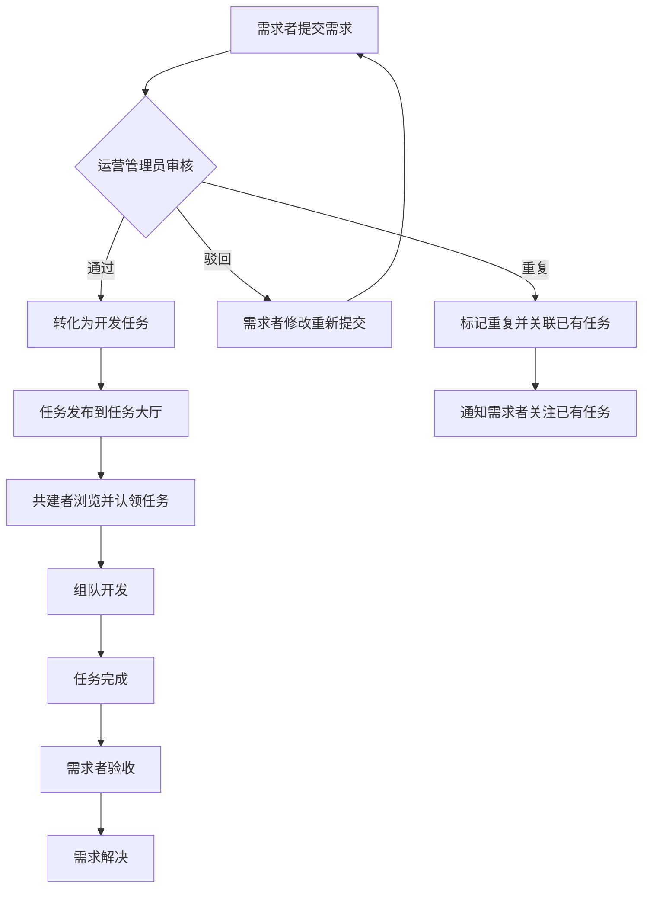

### 1.2 时序图

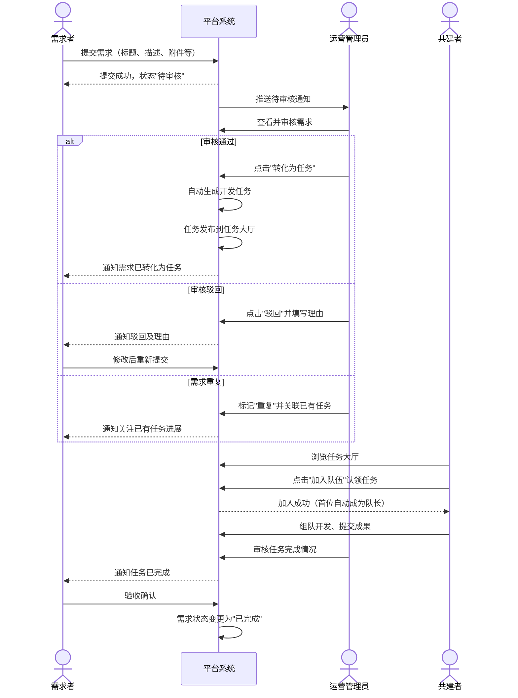

------

## 二、用户注册流程

### 2.1 流程图

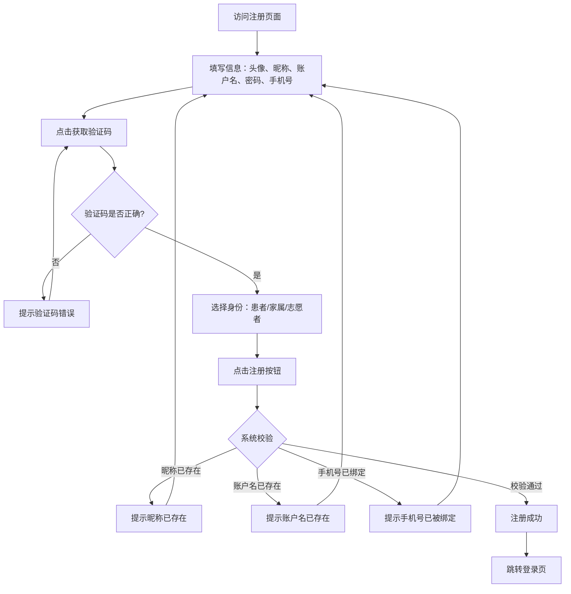

### 2.2 时序图

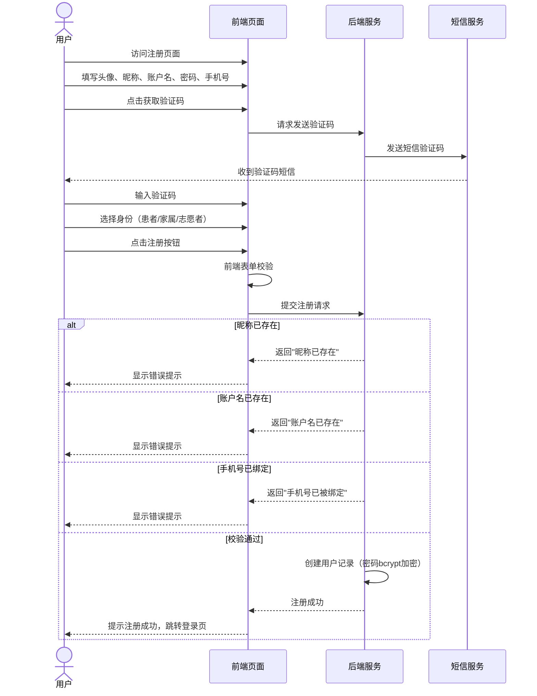

------

## 三、需求提交流程

### 3.1 流程图

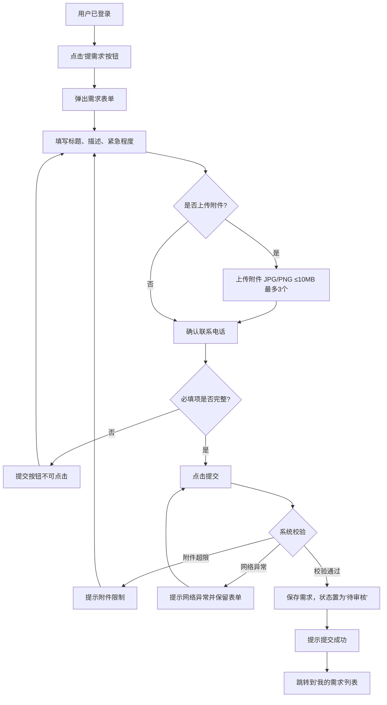

### 3.2 时序图

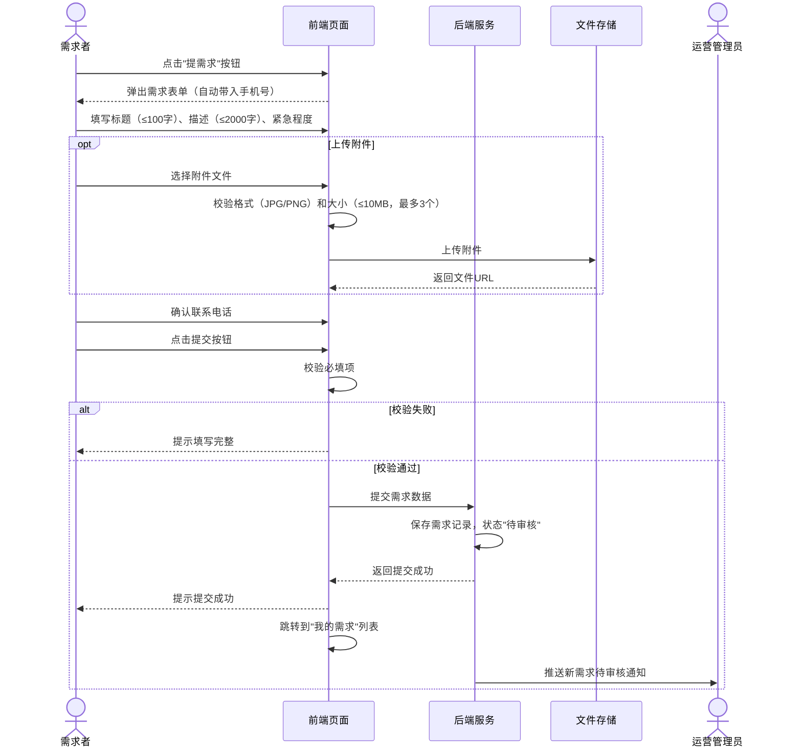

------

## 四、需求审核与转化流程

### 4.1 流程图

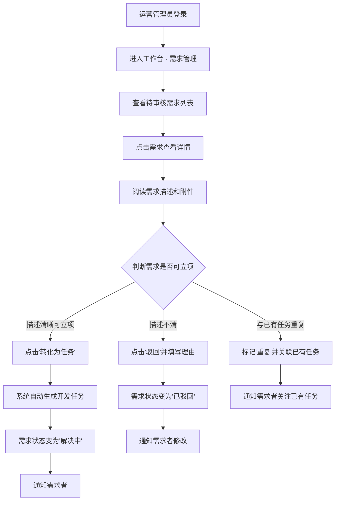

### 4.2 时序图

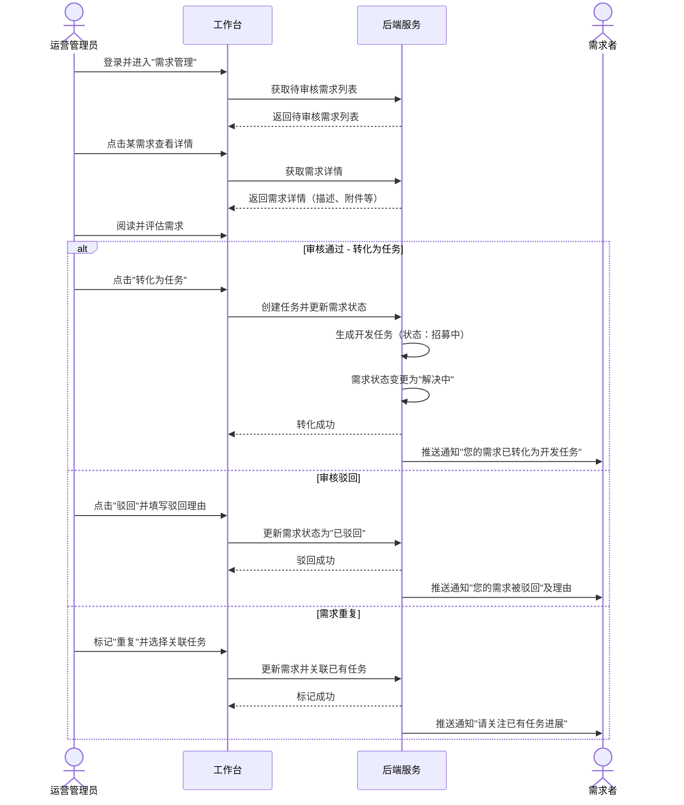

------

## 五、任务认领与组队流程

### 5.1 流程图

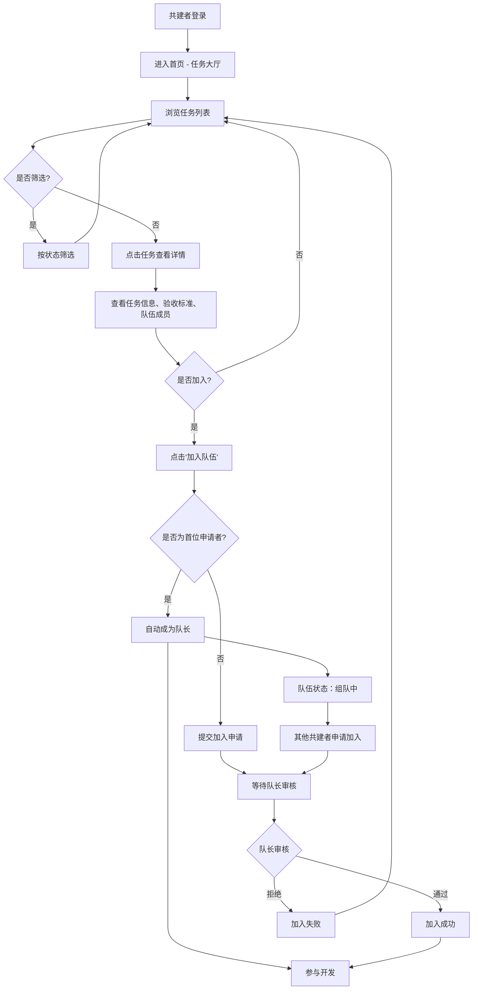

### 5.2 时序图

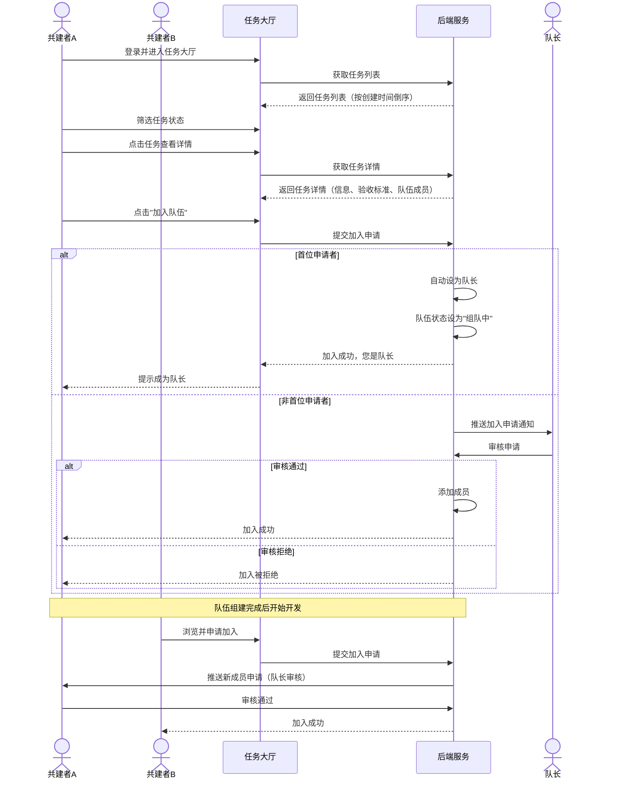

------

## 六、用户登录流程

### 6.1 流程图

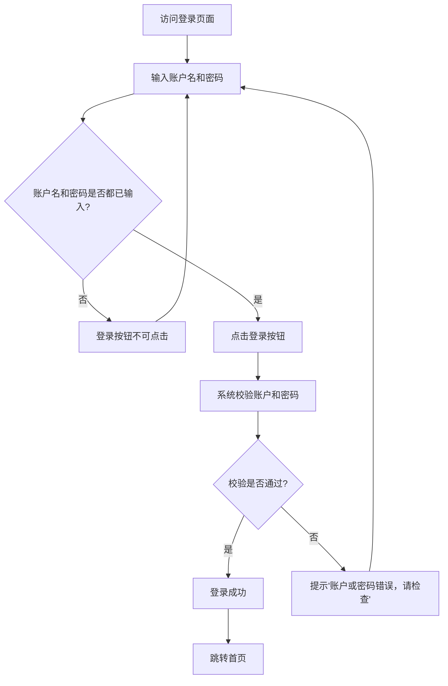

### 6.2 时序图

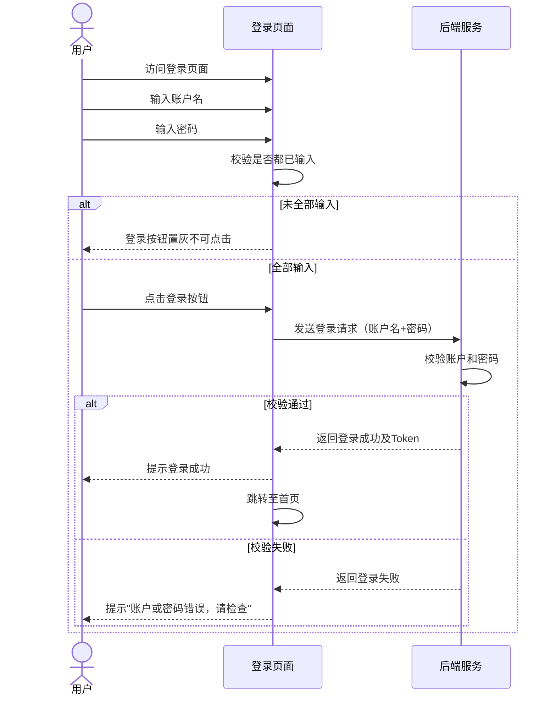

------

## 七、忘记密码流程

### 7.1 流程图

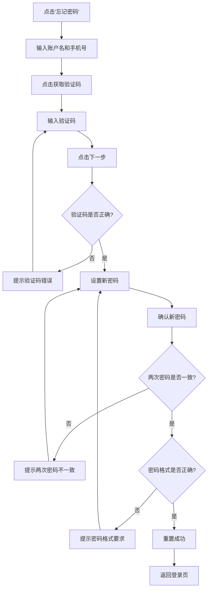

### 7.2 时序图

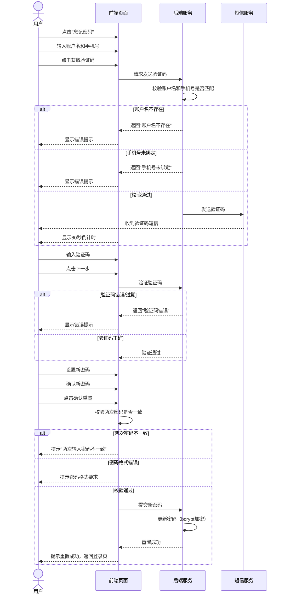

------

## 📊 流程总览

| 序号 | 流程名称             | 主要参与角色               | 关键节点                        |
| ---- | -------------------- | -------------------------- | ------------------------------- |
| 1    | 罕见病需求处理主流程 | 需求者、运营管理员、共建者 | 提交→审核→转化→认领→开发→验收   |
| 2    | 用户注册流程         | 新用户                     | 填写信息→验证码→选择身份→注册   |
| 3    | 需求提交流程         | 需求者                     | 填写表单→上传附件→提交→待审核   |
| 4    | 需求审核与转化流程   | 运营管理员                 | 查看详情→通过/驳回/标记重复     |
| 5    | 任务认领与组队流程   | 共建者                     | 浏览→查看详情→加入队伍→队长审核 |
| 6    | 用户登录流程         | 所有用户                   | 输入账户密码→校验→跳转首页      |
| 7    | 忘记密码流程         | 已注册用户                 | 验证手机→验证码→设置新密码      |

以上流程图和时序图均使用 **Mermaid** 语法绘制，您可以直接复制到支持 Mermaid 的工具（如 Typora、VS Code、飞书文档等）中渲染查看。如需调整任何流程的细节，请随时告诉我！
